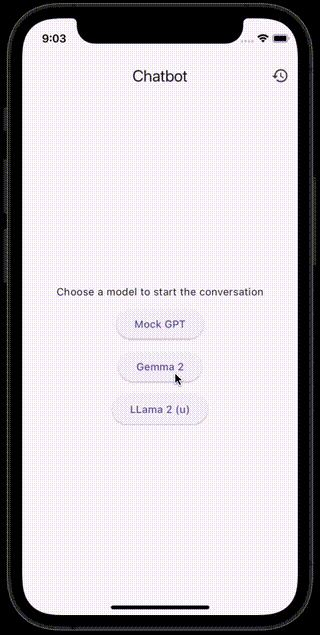

# Flutter AI Chat Bot Learning Path

Welcome to the Flutter Chat Bot Learning Path! 
This repository is designed to guide you through building an AI chat bot application using Flutter, step by step. Each exercise in this series will introduce new concepts and features, helping you learn Flutter while creating a functional chat bot.

## Getting Started

To begin your journey, start with the `ex00_setup` folder. Each exercise folder contains its own README with instructions, code samples, and explanations.

## Exercises

| Exercise | Topic | Description |
|----------|-------|-------------|
| [ex00_setup](./ex00_setup/README.md) | Setup | Initial project setup and environment configuration |
| [ex01](./ex01/README.md) | TBU | TBU |
| More exercises coming soon! | | |