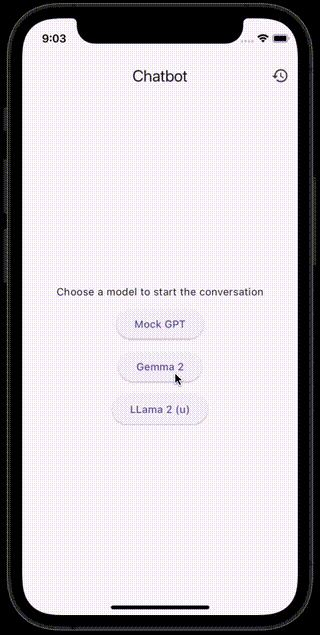

# Flutter AI Chat Bot Learning Path

Welcome to the Flutter Chat Bot Learning Path! 
This repository is designed to guide you through building an AI chat bot application using Flutter, step by step. Each exercise in this series will introduce new concepts and features, helping you learn Flutter while creating a functional chat bot.

## Getting Started

To begin your journey, start with the `ex00_setup` folder. Each exercise folder contains its own README with instructions, code samples, and explanations.

## Exercises

| Exercise | Topic  |
|----------|-------|
| [ex00_setup](./ex00_setup/README.md) | Initial project setup and environment configuration |
| [ex01](./ex01/README.md) | State management & event handling |
| [ex02](./ex02/README.md) | Backend configuration and Flutter package integration |
| [ex03](./ex03/README.md) | Integrating a mock LLM API with the Flutter application  |
| [ex04](./ex04/README.md) | Enhanced UI with conditional styling, auto-scrolling, and additional state management  |
| ex05| Independent project (assignment): Extend functionality and implement creative features  |

## Integrating a Real Model
You can integrate a real model through one of these methods:
1. If you have an API key for a hosted model like ChatGPT, Anthropic, or Gemini, modify the `_sendMessage` function.
2. Set up [`Ollama`](https://ollama.com), download models locally, and use the Ollama HTTP API.
